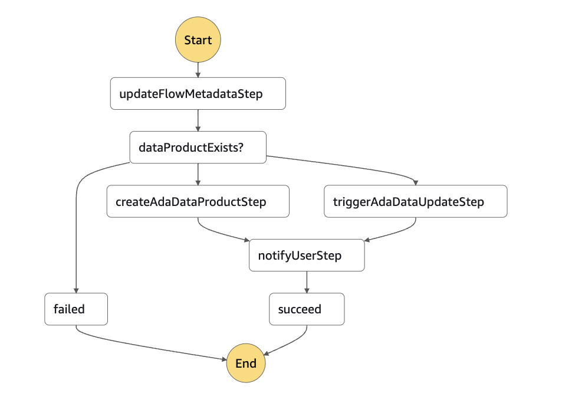
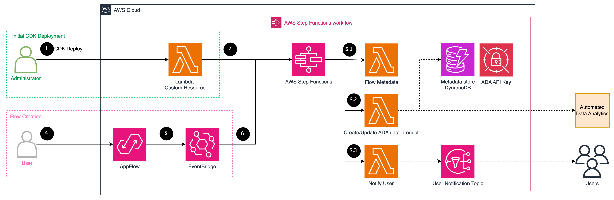

# Automated Data Analytics(ADA) Amazon AppFlow Extension

[Automated Data Analytics(ADA)](https://aws.amazon.com/solutions/implementations/automated-data-analytics-on-aws/) on AWS enables customers to derive meaningful insights from data in a matter of minutes through a simple and intuitive user interface. ADA currently supports multiple source types such as CSV files, [Amazon Simple Storage Service (Amazon S3)](https://aws.amazon.com/s3/) bucket, [Amazon DynamoDB](https://aws.amazon.com/dynamodb/), [Amazon Kinesis Data Streams](https://aws.amazon.com/kinesis/data-streams/) and various others.  
[Amazon AppFlow](https://aws.amazon.com/appflow/) is an integration service that enables you to securely transfer data between SaaS applications and AWS services without code.  
The ADA Extension streamlines the integration process, making it easy to connect ADA with a multitude of external SaaS data sources through Amazon AppFlow. This connection allows for the automatic retrieval and integration of data, eliminating the need for users to manually configure data flows within ADA.  

This extension leverages [Amazon EventBridge](https://aws.amazon.com/eventbridge/), [AWS Lambda](https://aws.amazon.com/lambda/) and [AWS Step Functions](https://aws.amazon.com/step-functions/) to orchestrate ADA data-product creation for a source AppFlow flow by consuming flow execution events.  
When an AppFlow flow execution with destination S3 ends succesfully, the event will trigger step function state machine. The state machine will create the respective ADA data-product. If the data-product already exists, the extension will trigger data update start for the respective data-product.  
The metadata of the execution and the events will be stored in a DynamoDB table for tracing and debugging purposes.  
Once the data-product creation/data update is completed, a notification email will be sent. You can set the notification email when deploying the extension.  

The following illustrates the state machine definition for better comprehension:  
  

The extension only supports AppFlow flow where the destination is a S3 bucket. In ADA, a data-product with S3 as source will be created. If the flow destination is some other data source, the event notification will be skipped and no ADA data-product will be created.  

The extension also supports exisiting (at the time of extension deployment) AppFlow flows where the destination is a S3 bucket. When deploying the solution, a Lambda function will list and filter all the target flows and trigger the state machine to create respective ADA data-products.  

## Solution Architecture  

  

The primary components of the extension's architecture are:  
- Amazon EventBridge events for `AppFlow End Flow Run Report` with `destination: S3` and `status: Execution Successful`.
- AWS Lambda functions for interacting with ADA APIs.
- AWS Step Functions for orchestrating the Lambda functions and Amazon DynamoDB for storing metadata.
- [AWS Secrets Manager](https://aws.amazon.com/secrets-manager/) for storing ADA API Key secret.
- [Amazon Simple Notification Service](https://aws.amazon.com/sns/) for sending email notification about the extension execution.

> NOTE: Please follow security best practices to handle PII data, if present in the flow destination bucket.  

## Pre-requisites  

- [AWS Cloud Development Kit](https://docs.aws.amazon.com/cdk/v2/guide/home.html) version 2.100.0 or higher.
- Docker version 1.41 or higher.
- [ADA APIs Access](https://docs.aws.amazon.com/solutions/latest/automated-data-analytics-on-aws/access-the-ada-apis.html)

## Deployment  

Deploy the stack  
```
cdk deploy \
    --parameters AdaApiBaseUrl=<url> \
    --parameters AdaApiKey=<apikey> \
    --parameters AdaAccountId=<awsaccountid> \
    --parameters AdaAppflowExtDomainName=<domain_name> \
    --parameters AdaAppflowExtUserGroupName=<usergroup_name> \
    --parameters AdaAppflowExtNotificationEmail=<notification_email>
```  
This will deploy all the required services and execute a Lambda function to create ADA data-products for existing AppFlow flows.

## Security

See [CONTRIBUTING](CONTRIBUTING.md#security-issue-notifications) for more information.

## License

This library is licensed under the Apache 2.0 License. See the LICENSE file.
